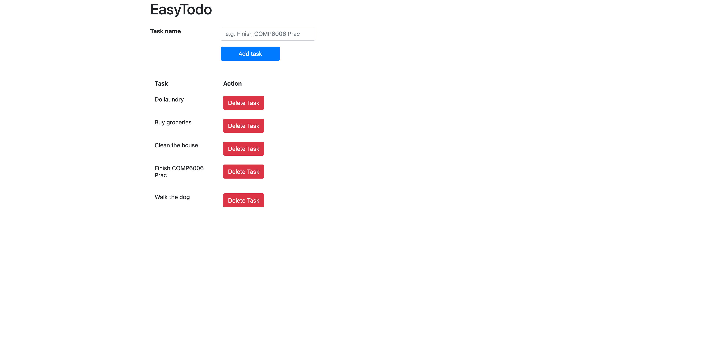

# easytodo
EasyTodo App

# Preview

Here's a preview of what the app looks like:

  

## Available Scripts

In the project directory, you can run:

### `npm start`

Runs the app in the development mode.\
Open [http://localhost:3003](http://localhost:3003) to view it in your browser.
